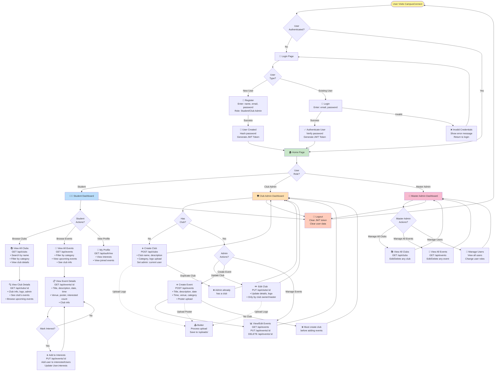
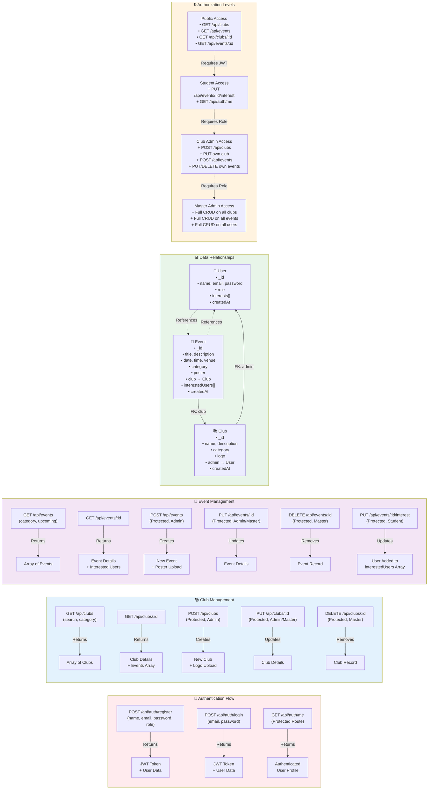

# CampusConnect - System Diagrams

All diagrams in Mermaid format. You can:
- 📋 Copy-paste into [Mermaid Live Editor](https://mermaid.live)
- 📥 Export as PNG/SVG
- 📝 Use in documentation

---

## 1️⃣ System Architecture Diagram

```mermaid
graph TB
    subgraph Client["🖥️ Client Layer"]
        Web["Web Browser<br/>HTML/CSS/JavaScript"]
        Mobile["📱 Mobile Browser<br/>Responsive PWA"]
    end
    
    subgraph Frontend["Frontend Pages"]
        Home["index.html<br/>(Home)"]
        Login["login.html<br/>(Authentication)"]
        Dashboard["dashboard.html<br/>(User Dashboard)"]
        ClubsPage["clubs.html<br/>(Browse Clubs)"]
        ClubProfile["club-profile.html<br/>(Club Details)"]
        EventsPage["events.html<br/>(Browse Events)"]
        AdminDash["admin-dashboard.html<br/>(Club Admin)"]
        MasterAdmin["master-admin.html<br/>(System Admin)"]
    end
    
    subgraph Server["🔧 Backend Server - Node.js/Express"]
        API["API Gateway<br/>/api/*"]
        AuthRoute["Auth Routes<br/>/api/auth"]
        ClubsRoute["Clubs Routes<br/>/api/clubs"]
        EventsRoute["Events Routes<br/>/api/events"]
    end
    
    subgraph Middleware["Middleware Layer"]
        CORS["CORS<br/>Cross-Origin Support"]
        BodyParser["Body Parser<br/>JSON/URL-encoded"]
        Auth["JWT Auth<br/>Token Verification"]
        Authorization["Role-Based Access<br/>Student/Admin/MasterAdmin"]
        FileUpload["Multer<br/>File Uploads"]
    end
    
    subgraph Models["📊 Data Models"]
        User["User Model<br/>• name, email, password<br/>• role: student/clubAdmin/masterAdmin<br/>• interests, createdAt"]
        Club["Club Model<br/>• name, description, category<br/>• logo, admin, createdAt"]
        Event["Event Model<br/>• title, date, time, venue<br/>• category, poster<br/>• club, interestedUsers"]
    end
    
    subgraph Database["🗄️ MongoDB Database"]
        UserDB["Users Collection"]
        ClubDB["Clubs Collection"]
        EventDB["Events Collection"]
    end
    
    subgraph Storage["📁 File Storage"]
        Uploads["uploads/ Directory<br/>Club Logos<br/>Event Posters"]
    end
    
    subgraph Security["🔐 Security"]
        JWT["JWT Tokens<br/>7-day Expiry"]
        BCrypt["Password Hashing<br/>bcryptjs"]
    end
    
    Web -->|HTTP Request| Home
    Mobile -->|HTTP Request| Home
    Home -->|Navigation| Login
    Home -->|Navigation| Dashboard
    Home -->|Navigation| ClubsPage
    Home -->|Navigation| EventsPage
    Home -->|Navigation| AdminDash
    
    Login -->|API Call| AuthRoute
    Dashboard -->|API Call| EventsRoute
    ClubsPage -->|API Call| ClubsRoute
    ClubProfile -->|API Call| ClubsRoute
    EventsPage -->|API Call| EventsRoute
    AdminDash -->|API Call| ClubsRoute
    AdminDash -->|API Call| EventsRoute
    MasterAdmin -->|API Call| API
    
    AuthRoute -->|Uses| Auth
    AuthRoute -->|Uses| BCrypt
    ClubsRoute -->|Uses| Auth
    ClubsRoute -->|Uses| Authorization
    ClubsRoute -->|Uses| FileUpload
    EventsRoute -->|Uses| Auth
    EventsRoute -->|Uses| Authorization
    EventsRoute -->|Uses| FileUpload
    
    API -->|Uses| CORS
    API -->|Uses| BodyParser
    
    AuthRoute -->|CRUD| User
    ClubsRoute -->|CRUD| Club
    ClubsRoute -->|CRUD| User
    EventsRoute -->|CRUD| Event
    EventsRoute -->|CRUD| User
    EventsRoute -->|CRUD| Club
    
    User -->|Persist| UserDB
    Club -->|Persist| ClubDB
    Event -->|Persist| EventDB
    
    ClubsRoute -->|Store| Uploads
    EventsRoute -->|Store| Uploads
    
    AuthRoute -->|Generate/Verify| JWT
    
    style Client fill:#e1f5ff
    style Frontend fill:#f3e5f5
    style Server fill:#e8f5e9
    style Middleware fill:#fff3e0
    style Models fill:#fce4ec
    style Database fill:#f1f8e9
    style Storage fill:#ede7f6
    style Security fill:#ffebee
```

---

## 2️⃣ Complete User Workflow Diagram

---

## 3️⃣ API Routes & Data Model Diagram

---

## 📥 How to Download

### Option 1: Use Mermaid Live Editor
1. Go to [mermaid.live](https://mermaid.live)
2. Copy-paste any diagram code above
3. Click **Export** → **Download as PNG/SVG**

### Option 2: Use VS Code Mermaid Extension
1. Install "Markdown Preview Mermaid Support"
2. Create `.mmd` files with the code
3. Preview and export

### Option 3: Save as Files
The Mermaid code is already saved in `DIAGRAMS.md` in your project root!
